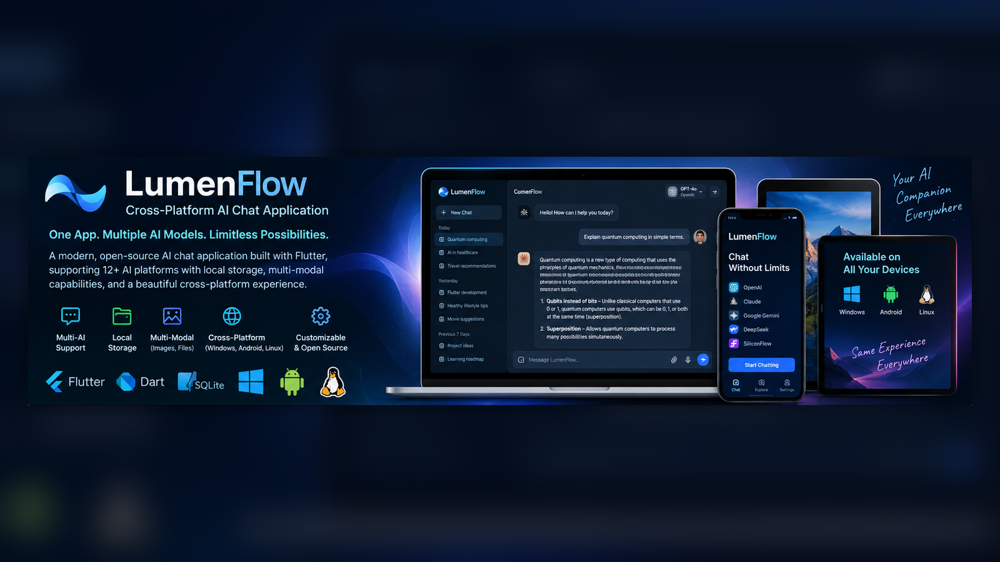
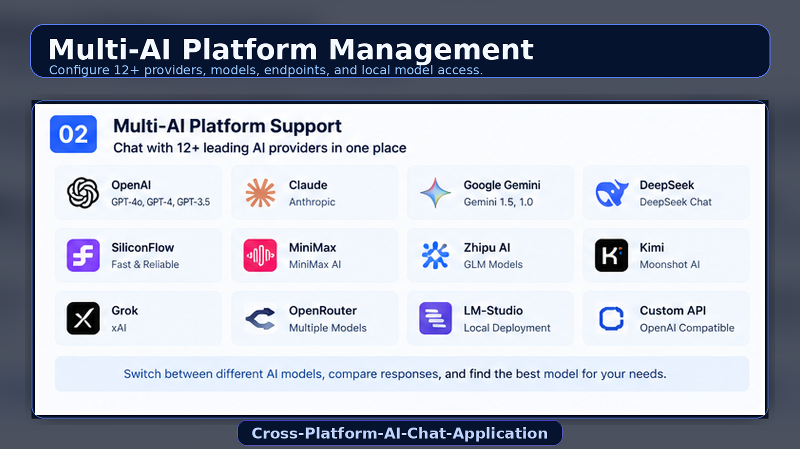
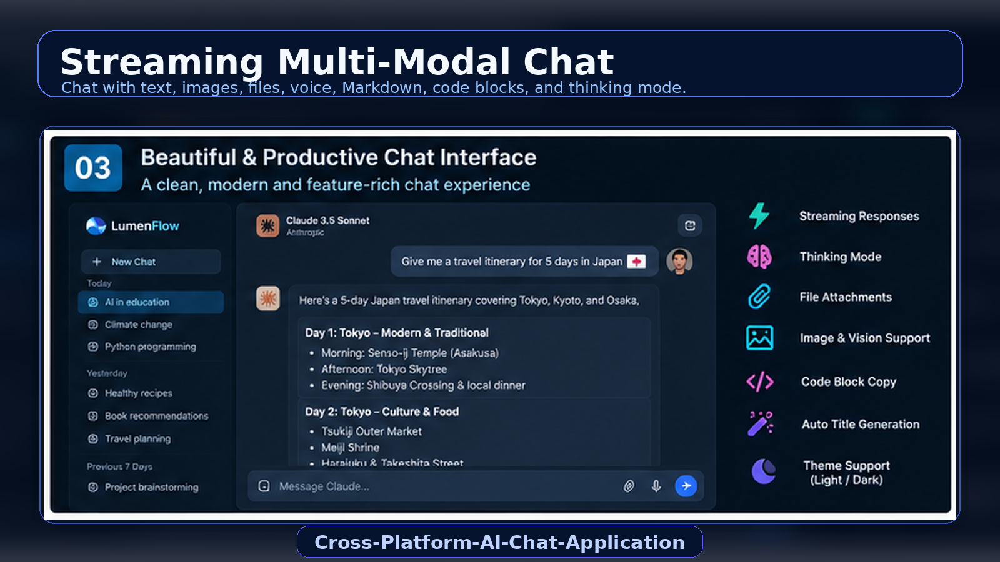
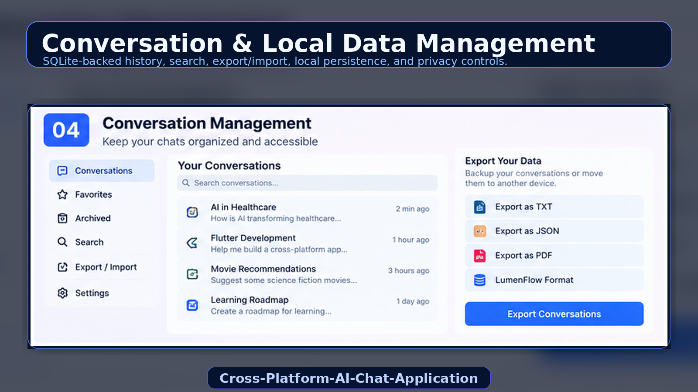
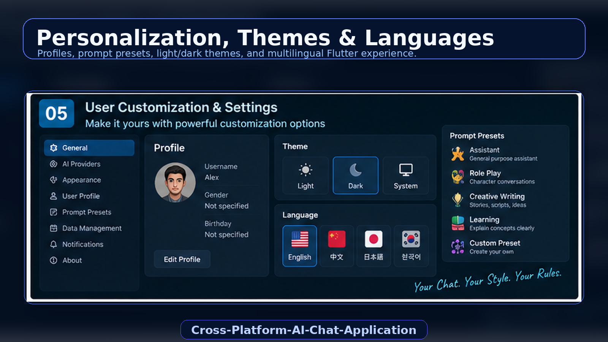

<p align="center">
  
</p>

<h1 align="center">Cross-Platform-AI-Chat-Application</h1>

<p align="center">
  <strong>LumenFlow — a Flutter-based AI chat application for Android, Windows, and Linux with 12+ AI providers, local SQLite storage, multimodal chat, prompt presets, and full conversation management.</strong>
</p>

<p align="center">
  
  
  
  
  
  
</p>

<p align="center">
  <a href="#-overview">Overview</a> •
  <a href="#-product-preview">Preview</a> •
  <a href="#-features">Features</a> •
  <a href="#-architecture">Architecture</a> •
  <a href="#-configuration">Configuration</a> •
  <a href="#-building">Building</a> •
  <a href="#-project-structure">Structure</a>
</p>

---

## 🚀 Overview

**Cross-Platform-AI-Chat-Application** is a modern Flutter AI chat client whose application experience is branded as **LumenFlow**. It is designed to provide one consistent conversational interface across **Android, Windows, and Linux** while supporting **12+ AI providers**, local SQLite persistence, rich conversation management, multimodal attachments, prompt presets, internationalization, and configurable platform/model settings.

The application uses a provider-based architecture so different AI services can be managed through a common interface while still keeping provider-specific endpoints, model lists, and configuration options isolated.

### Core idea

```text
One Flutter Application
        ↓
12+ AI Providers
        ↓
Unified Streaming Chat Experience
        ↓
Images / Files / Audio / Video
        ↓
Local SQLite Conversation Storage
        ↓
Profiles + Presets + Themes + Languages
        ↓
Android / Windows / Linux
```

---

## ✨ Product Preview

> [!NOTE]
> The five visuals below are stored as **five separate image files** in `docs/images/` and are displayed individually in this README.

### 1. Cross-Platform Product Overview

<p align="center">
  
</p>

A high-level view of the application experience across desktop and mobile, with Flutter, Dart, SQLite, multimodal support, and multiple AI platforms working under one interface.

---

### 2. Multi-AI Platform Management

<p align="center">
  
</p>

Configure multiple AI providers independently, maintain separate model lists and API settings, and switch between cloud or local model providers from a unified platform-management layer.

---

### 3. Streaming Multi-Modal Chat

<p align="center">
  
</p>

A modern conversational interface with streaming responses, Markdown rendering, code-block copy actions, thinking-mode support, and attachments for images, files, audio, and video.

---

### 4. Conversation & Local Data Management

<p align="center">
  
</p>

Conversation history stays available locally through SQLite, with search, caching, export/import, attachment metadata, automatic migration, and structured data management.

---

### 5. Personalization, Themes & Languages

<p align="center">
  
</p>

Personalize the application through user profiles, prompt presets, language selection, platform-specific settings, and light/dark/system appearance modes.

---

## 🌟 Features

### Core AI Capabilities

- **12+ AI Platform Support** — OpenAI, Claude, Google Gemini, DeepSeek, SiliconFlow, MiniMax, Zhipu AI, Kimi, LM-Studio, Grok, OpenRouter, and custom OpenAI-compatible APIs
- **Provider Pattern Architecture** — all AI integrations implement a shared provider abstraction
- **Multi-Platform AI Management** — configure several providers at the same time with independent endpoints, API keys, model lists, and parameters
- **Streaming Responses** — real-time token streaming for a responsive chat experience
- **Thinking Mode** — visualize model reasoning/thinking state for providers that support it
- **Auto Title Generation** — automatically generate conversation titles from chat content

### Data Management

- **SQLite Database** — local persistence using `sqlite3`
- **Conversation Management** — locally stored chat history with caching and search
- **Automatic Data Migration** — migration from legacy SharedPreferences storage into SQLite
- **Export / Import** — TXT, JSON, PDF, and LumenFlow-format exports
- **Database Transactions** — ACID-style operations and foreign-key constraints
- **Indexed Queries** — indexes on frequently accessed fields for better local performance

### User Experience

- **Multi-Modal Support** — images, videos, audio, and file-based content
- **File Attachments** — upload and extract supported file content
- **User Profiles** — avatar, username, gender, birthday, and preference customization
- **Role Card Generator** — web-based persona/character card generation
- **Prompt Presets** — role-playing and reusable prompt templates
- **Multi-Language Presets** — preset language follows the selected interface language
- **Theme Management** — light, dark, and system-theme behavior
- **Internationalization** — English, Chinese, Japanese, and Korean

### Technical Features

- **Local Notifications** with `flutter_local_notifications`
- **Markdown Rendering** with `flutter_markdown_plus`
- **Code Block Copy** and full-message copy actions
- **Retry Mechanism** with exponential backoff
- **Localized Error Handling** in all supported interface languages
- **Performance Optimizations** with reduced repaints and debouncing

---

## 🧩 Architecture

The application follows a layered Flutter architecture:

```text
┌──────────────────────────────────────┐
│               Screens                │
│ Chat · Settings · Profile · History  │
└─────────────────┬────────────────────┘
                  │
                  ▼
┌──────────────────────────────────────┐
│               Widgets                │
│ Chat Input · Message Bubble · Tiles  │
└─────────────────┬────────────────────┘
                  │
                  ▼
┌──────────────────────────────────────┐
│               Services               │
│ AI · Conversation · Files · Settings │
└──────────────┬──────────────┬────────┘
               │              │
               ▼              ▼
┌──────────────────────┐  ┌──────────────────────┐
│    AI Providers      │  │        SQLite        │
│ OpenAI / Gemini /... │  │ Conversations / Msgs │
└──────────────────────┘  └──────────────────────┘
```

### Layers

1. **Models** — application data structures
2. **Services** — business logic, persistence, and API integration
3. **Screens** — page-level Flutter UI
4. **Widgets** — reusable user-interface components
5. **Providers** — AI provider implementations behind an abstract interface
6. **Localization** — ARB-based English, Chinese, Japanese, and Korean translations

---

## 🧠 Data Models

| Model | Purpose |
|---|---|
| `Conversation` | Conversation metadata and message collection |
| `Message` | Individual message content, sender, and status |
| `UserProfile` | User-specific profile and preferences |
| `Attachment` | Image, video, audio, and document attachment metadata |
| `PromptPreset` | Reusable prompt/persona configuration |
| `AIPlatform` | Provider endpoint, models, credentials, and provider settings |

---

## ⚙️ Services

| Service | Responsibility |
|---|---|
| `AIService` | Request formatting, provider communication, streaming response handling, and multimodal support |
| `ConversationService` | Conversation persistence and retrieval |
| `SettingsService` | Application and multi-provider configuration |
| `ConversationDatabase` | SQLite persistence and migration logic |
| `UserService` | User profile management |
| `FileService` | Attachment reading, extraction, and file processing |
| `PromptService` | Prompt preset loading and management |
| `NotificationService` | Local notifications |
| `VersionService` | Version information |
| `LiveUpdateService` | Application update handling |
| `HttpServerService` | Embedded HTTP server for the character-card generator |

---

## 🤖 AI Provider Architecture

The application uses `AIProvider` as an abstract base interface and provides provider-specific implementations.

| Provider | Implementation |
|---|---|
| OpenAI | `OpenAIProvider` |
| Google Gemini | `GeminiProvider` |
| DeepSeek | `DeepSeekProvider` |
| Claude / Anthropic | `ClaudeProvider` |
| SiliconFlow | `SiliconFlowProvider` |
| MiniMax | `MiniMaxProvider` |
| Zhipu AI | `ZhipuProvider` |
| Kimi | `KimiProvider` |
| LM-Studio | `LMStudioProvider` |
| Grok / xAI | `GrokProvider` |
| OpenRouter | `OpenRouterProvider` |
| Custom OpenAI-compatible API | `OtherProvider` |

This provider pattern makes it possible to add a new AI service without redesigning the chat interface or conversation database.

---

## 🗄 SQLite Database Architecture

The application stores chat data locally with SQLite.

### Main tables

```text
conversations
messages
attachments
settings
```

### Database characteristics

- synchronized single-instance connection
- foreign-key constraints
- cascade delete behavior
- transactional writes
- automatic SharedPreferences → SQLite migration
- indexes for frequently queried fields
- platform-specific local database path

### Storage locations

```text
Android       Application documents directory / conversations.db
Windows       ~/.lumenflow/conversations.db
Linux         ~/.lumenflow/conversations.db
```

All conversation data remains local unless it is explicitly sent to an AI provider as part of a request.

---

## 🛠 Project Structure

```text
Cross-Platform-AI-Chat-Application/
│
├── lib/
│   ├── main.dart
│   │
│   ├── l10n/
│   │   ├── app_en.arb
│   │   ├── app_zh.arb
│   │   ├── app_ja.arb
│   │   ├── app_ko.arb
│   │   └── app_localizations*.dart
│   │
│   ├── models/
│   │   ├── conversation.dart
│   │   ├── message.dart
│   │   ├── user_profile.dart
│   │   ├── attachment.dart
│   │   ├── prompt_preset.dart
│   │   └── ai_platform.dart
│   │
│   ├── screens/
│   │   ├── chat_screen.dart
│   │   ├── conversation_list_screen.dart
│   │   ├── settings_screen.dart
│   │   ├── user_profile_screen.dart
│   │   ├── about_screen.dart
│   │   ├── image_preview_screen.dart
│   │   ├── platform_settings_screen.dart
│   │   ├── api_settings_screen.dart
│   │   ├── appearance_settings_screen.dart
│   │   ├── conversation_settings_screen.dart
│   │   ├── model_settings_screen.dart
│   │   └── advanced_settings_screen.dart
│   │
│   ├── services/
│   │   ├── ai_service.dart
│   │   ├── conversation_service.dart
│   │   ├── settings_service.dart
│   │   ├── conversation_database.dart
│   │   ├── user_service.dart
│   │   ├── file_service.dart
│   │   ├── prompt_service.dart
│   │   ├── notification_service.dart
│   │   ├── version_service.dart
│   │   ├── live_update_service.dart
│   │   └── http_server_service.dart
│   │
│   ├── providers/
│   │   ├── ai_provider.dart
│   │   ├── openai_provider.dart
│   │   ├── gemini_provider.dart
│   │   ├── deepseek_provider.dart
│   │   ├── claude_provider.dart
│   │   ├── siliconflow_provider.dart
│   │   ├── minimax_provider.dart
│   │   ├── zhipu_provider.dart
│   │   ├── kimi_provider.dart
│   │   ├── lmstudio_provider.dart
│   │   ├── grok_provider.dart
│   │   ├── openrouter_provider.dart
│   │   └── other_provider.dart
│   │
│   ├── utils/
│   │   └── app_theme.dart
│   │
│   └── widgets/
│       ├── avatar_widget.dart
│       ├── chat_input.dart
│       ├── message_bubble.dart
│       └── settings/
│
├── docs/
│   └── images/
│       ├── 01_hero_overview.png
│       ├── 02_multi_ai_platforms.png
│       ├── 03_multimodal_chat.png
│       ├── 04_conversation_data.png
│       └── 05_settings_localization.png
│
├── README.md
└── LICENSE
```

---

## 📦 Dependencies

### Core Framework

- `flutter`
- `cupertino_icons`

### Networking & Data

- `http` — API requests
- `sqlite3` — local SQLite database
- `shared_preferences` — legacy storage used for migration

### File Handling

- `image_picker`
- `file_picker`
- `path_provider`
- `path`
- `pdf`
- `archive`

### UI & Internationalization

- `flutter_markdown_plus`
- `flutter_localizations`
- `intl`
- `flutter_svg`

### Utilities

- `url_launcher`
- `flutter_local_notifications`

---

## 🔧 Configuration

Before chatting, configure at least one AI provider.

1. Open **Settings**.
2. Select **Platform & Models**.
3. Add a new platform or edit an existing platform.
4. Enter the provider name, endpoint, and API key.
5. Configure the model and generation parameters.
6. Save the platform.
7. Set it as the active provider.

Multiple providers can be configured simultaneously and switched when needed.

### Common defaults

```text
Temperature    0.7
Max Tokens     8192
```

Provider model defaults are stored independently per platform and can be changed from settings.

> [!IMPORTANT]
> API endpoints, model names, and provider capabilities can change over time. Treat configured values as user-managed settings rather than permanent application constants.

---

## 🎭 Prompt Presets

The application includes file-based prompt presets with multilingual support.

```text
assets/prompt/characters/en/
assets/prompt/characters/zh/
assets/prompt/characters/ja/
assets/prompt/characters/ko/
```

A preset can point to an XML or TXT system-prompt definition.

Example:

```json
{
  "id": "assistant",
  "name": "Assistant",
  "description": "A reusable AI persona",
  "system_prompt": "characters/en/assistant.xml",
  "icon": "person.fill"
}
```

Supported features include:

- automatic language-based preset selection
- file-based system prompts
- `${userProfile.username}` variable substitution
- structured XML character definitions
- role-play behavior, linguistic style, interaction rules, and example dialogue

---

## 🌐 Internationalization

The interface supports:

- English
- Chinese
- Japanese
- Korean

Localization uses Flutter ARB files and the selected interface language also controls which prompt-preset language is loaded.

---

## 📤 Export & Import

Supported export formats include:

```text
TXT
JSON
PDF
LumenFlow Format
```

The application also supports settings export/import for backup and restore.

> [!WARNING]
> Exported settings may include sensitive configuration such as API keys. Store exported files securely.

---

## 🧱 Building

Install dependencies:

```bash
flutter pub get
```

### Android

```bash
flutter build apk --split-per-abi
```

### Windows

```bash
flutter build windows --release
```

### Linux

```bash
flutter build linux --release
```

### Included build scripts

**Windows PowerShell**

```powershell
.\build_apk.ps1
.\build_exe.ps1
```

**Linux**

```bash
./build_elf.sh
```

---

## 🧯 Error Handling

The application handles:

- network timeouts and connection failures
- TLS/SSL errors
- invalid API keys
- rate limits and quota errors
- missing models
- malformed responses
- file size and format errors
- SQLite constraint and transaction errors
- migration failures
- missing localization values

The error layer provides localized user-facing messages, automatic retry with exponential backoff for suitable network errors, graceful degradation, and internal logging.

---

## 🔐 Privacy & Local Data Notes

- Conversation history is stored locally in SQLite.
- User profiles and local application settings remain on the device.
- Attachments are represented locally with stored metadata and file references.
- API requests still send the selected conversation/input data to the configured AI provider when a request is made.
- Settings exports may contain sensitive provider credentials.

---

## 🗺 Future Direction

Possible future improvements for this architecture include:

- macOS support
- richer offline/local-model workflows
- cross-device encrypted synchronization
- provider capability discovery
- encrypted local credential storage
- additional export formats
- richer prompt library management
- plugin/tool calling layer
- advanced conversation search

---

## 🤝 Contributing

Contributions, bug fixes, provider integrations, UI improvements, and localization updates are welcome.

---

## 📄 License

This project is licensed under the **MIT License**.

---

<p align="center">
  <strong>Cross-Platform-AI-Chat-Application</strong><br/>
  <sub>One Interface → Multiple AI Providers → Conversations Everywhere</sub>
</p>
 
---
 
## 👨‍💻 Developer
 
<table>
  <tr>
    <td width="150" align="center">
      <br>
      <strong>Asad Ali</strong>
    </td>
    <td>
      <strong>AI, Blockchain & Software Engineer</strong><br><br>
      🐙 GitHub: <a href="https://github.com/AsadAliEng">@AsadAliEng</a><br>
      📧 Email: <a href="mailto:asadali.cryptoeng@gmail.com">asadali.cryptoeng@gmail.com</a><br>
      🚀 Focus: intelligent systems, applied machine learning, AI security, Web3 products, automation, and production-oriented engineering
    </td>
  </tr>
</table>

